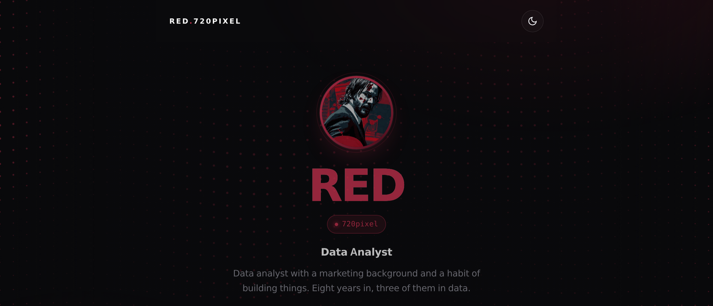

<!-- 720pixel · profile -->

 

 

### `~/live`

  

<a href="https://720p.red"><b>🌐&nbsp;&nbsp;720p.red</b></a>
 
<i>you are being watched. so is your cursor</i>

 

### `~/whoami`

<table align="center">
<tr><td>

> A perpetual beginner who learns by **doing** — wiring small tools together,
> taking them apart, and chasing the *why* until it clicks.
>
> Not here to look like an expert. Here to **stay curious, ship something,
> and be a little better than yesterday.** Friendly, reliable, and always
> happy to learn from people smarter than me.

</td></tr>
</table>

 

### `~/currently-tinkering-with`

<i>...and a long list of things I'm still figuring out.</i>

 

### `~/how-i-work`

🌱 &nbsp;Learn in public, one small commit at a time &nbsp;·&nbsp; 🧩 &nbsp;Break problems into pieces I can actually finish

🔍 &nbsp;Ask questions early, read the docs twice &nbsp;·&nbsp; 🤝 &nbsp;Easy to work with, quick to say *"teach me"*

 

### `~/say-hello`

&nbsp;

  

<i>“The more I learn, the more I realize how much I don't know.”</i>

<!-- refreshed -->
